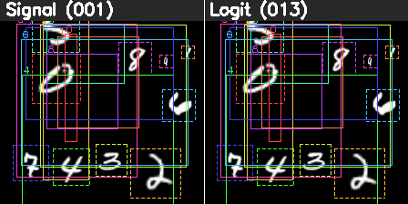
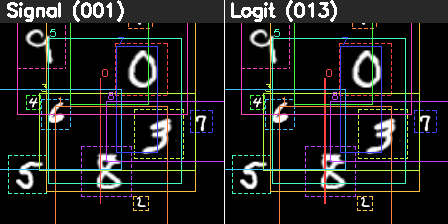
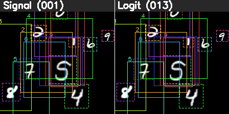
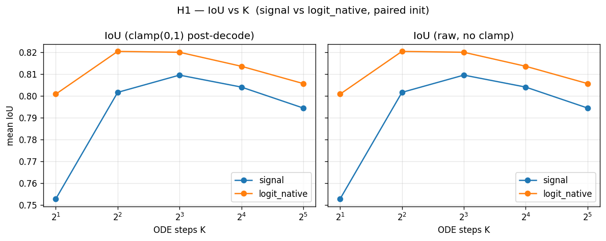
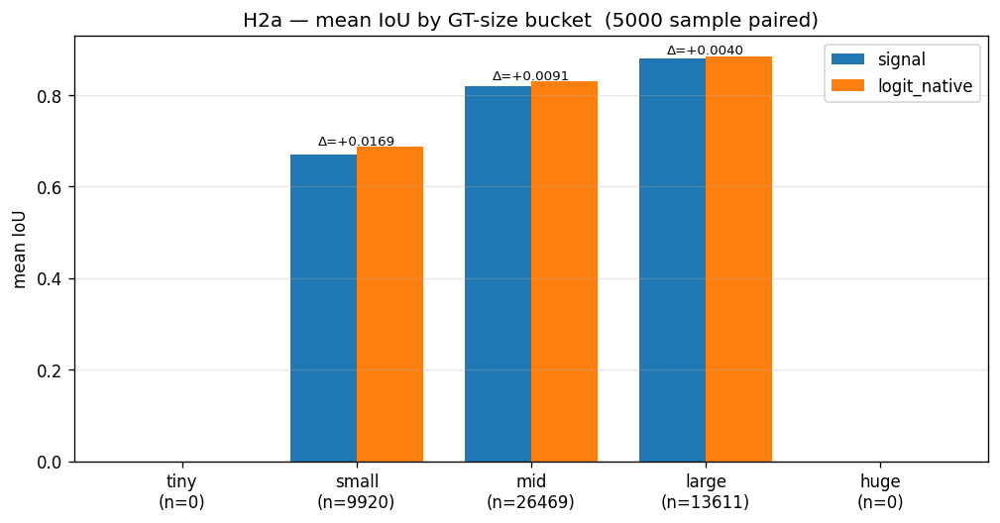
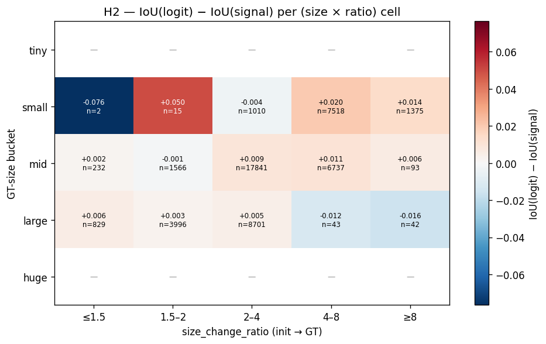

# riemannian_box_flow

10-query box flow matching on a 224×224 MNIST canvas (digits 0–9 placed once each).
Compares **signal-space FM** vs **logit-space (Riemannian) FM** to isolate where
each chart wins.

| Sample | Signal (001) ↔ Logit (013), K=10 ODE Euler |
|--------|--------------------------------------------|
| GT 색깔 점선 / pred 실선, t=0 → t=1 11 frame |  |
| |  |
| |  |

> 두 모델 모두 noise box 에서 시작해 `b_0 → b_1` 로 흐른다. 같은 init seed 로 paired 비교. 좌측: signal chart `s = 6b−3`, 우측: logit chart `y = log(b/(1−b))`.

---

## 핵심 결과 — Phase 3.0 두 강점 검증

상세 분석은 [`outputs/logit_strengths/REPORT.md`](outputs/logit_strengths/REPORT.md).

### H1 — K-robustness (적은 ODE step 에서 logit 우위)

5000 sample paired, K ∈ {2, 4, 8, 16, 32}.

| K  | IoU signal | IoU logit | Δ | Wilcoxon p |
|---:|-----------:|----------:|---:|-----------:|
| **2**  | 0.753 | **0.801** | **+0.048** | ≈0 |
| 4  | 0.802 | 0.820 | +0.019 | 2.7e-128 |
| 8  | 0.810 | 0.820 | +0.010 | 2.8e-14 |
| 16 | 0.804 | 0.813 | +0.010 | 1.3e-07 |
| 32 | 0.794 | 0.806 | +0.011 | 1.2e-25 |



K=2 같은 저-step 추론에서 logit chart 가 압도적. K↑ 일수록 격차 +0.001 ~ +0.011 로 수렴.
trained signal 은 자발적으로 [-3, 3] 에 머무므로 (coord-OOB rate = 0) 전통적인 "signal 은 bound 밖으로 튄다" framing 은 본 toy 에 적용 불가 — 실제 강점은 **K-robustness**.

### H2 — small box / 큰 size 변환에서 logit 우위

5000 sample × 10 query = 50000 box, K=10.

| GT-size bucket | n | IoU signal | IoU logit | Δ | size_err Δ | center_err Δ |
|---|---:|---:|---:|---:|---:|---:|
| small (area 0.0025–0.01) | 9920 | 0.670 | **0.686** | **+0.017** | −0.001 (−5%) | **−0.008 (−13%)** |
| mid (0.01–0.04) | 26469 | 0.820 | 0.829 | +0.009 | ≈0 | −0.005 (−17%) |
| large (0.04–0.16) | 13611 | 0.881 | 0.885 | +0.004 | −0.0004 | −0.002 (−10%) |



box 가 작을수록 logit 우위 ↑ — 단조 감소. size_change_ratio 별로도 ratio 4–8 에서 격차 +0.016 가장 큼. size_err 도 logit 이 모든 bucket 우위지만 IoU 격차의 **주된 원인은 center_err 감소** (small bucket −13%) — logit 의 `1/(x(1−x))` 가 4성분 모두에서 boundary-amplifying.



(size × ratio) heatmap: 대부분 cell 에서 logit 우위 (붉은색). 가장 큰 격차는 (small, 4–8) cell +0.020.

---

## 프로젝트 구조

```
PROJECT.md         ← 목표 / 범위 / 성공 기준
STATUS.md          ← 현재 위치 + 최근 완료 일지
TODO.md            ← 실행 큐 (Now 1개 + Next + Done)
ISSUES.md          ← 문제 / 버그 / 리스크
CLAUDE.md          ← Claude 작업 규칙
plans/             ← 모듈별 설계 (active.md = 현재 방향)
plans/archive/     ← 완료된 phase 계획 (training, comparison, setup_analysis, riem_strength, logit_strengths …)

dataset/           ← MNISTBoxDataset (224×224 canvas, 10 digits)
model/
├─ trajectory.py   ← signal/chart/logit/corner_logit encode·decode + euclidean/riemannian trajectory
├─ flow_signal.py        ← S-E (Phase 1, 001)
├─ flow_chart.py         ← S-R (Phase 2, 002 — signal model + chart trajectory)
├─ flow_chart_native.py  ← C-R (003)
├─ flow_logit_native.py  ← Logit (013, 우승)
├─ flow_corner_logit.py  ← Corner-logit (014)
├─ flow_hybrid.py        ← Hybrid (007 — signal pos + chart size)
└─ flow_local.py         ← Scale-aware local chart (009)

training/          ← config + trainer + train CLI + visualize
inference/         ← compare / k_sweep / seed_var / boundary_audit / size_dynamics / gifs

outputs/{NNN}_{run}/   ← 자동 numbering 학습 결과 (TB log + ckpts + GIF)
outputs/logit_strengths/  ← Phase 3.0 산출물 (REPORT.md + figures + GIFs)
```

`plans/space_recipes.md` — 각 chart 의 box ↔ space 변환·학습 1 step·init range 정리.

---

## Docker

```bash
docker compose up -d --build
docker exec -it bflow_dev bash
```

`docker-compose.yml` 의 `shm_size: 8gb` 로 DataLoader 워커 충돌 방지 (`ISSUES.md`).

---

## 학습

기본은 35k step Euclidean (signal):

```bash
python -m training.train --run-name fullrun --model signal
# outputs/{NNN}_fullrun/  자동 생성 (TB 6006 동시 띄움)
```

다른 chart:

```bash
python -m training.train --run-name riemannian      --model chart
python -m training.train --run-name logit_native    --model logit_native
python -m training.train --run-name corner_logit    --model corner_logit
python -m training.train --run-name hybrid          --model hybrid
```

`--init-prior small_size` 로 small-box 분포 학습.
`--wide-dataset` 로 wide GT 분포 학습 (MNIST 의 size 분포 확장).

---

## 비교 / 분석

```bash
# paired comparison (axis 1 + 2)
python -m inference.compare \
  --ckpt-a outputs/001_fullrun/ckpt/final.pt \
  --ckpt-b outputs/013_logit_native_default/ckpt/final.pt \
  --out-dir outputs/comparison_default_logit

# K sweep
python -m inference.k_sweep --ckpt-a ... --ckpt-b ... --out-dir ...

# Phase 3.0 H1 — boundary audit
python -m inference.boundary_audit \
  --ckpt-signal outputs/001_fullrun/ckpt/final.pt \
  --ckpt-logit  outputs/013_logit_native_default/ckpt/final.pt \
  --out-dir outputs/logit_strengths/boundary_audit
python -m inference.boundary_figures

# Phase 3.0 H2 — size dynamics
python -m inference.size_dynamics \
  --ckpt-signal outputs/001_fullrun/ckpt/final.pt \
  --ckpt-logit  outputs/013_logit_native_default/ckpt/final.pt \
  --out-dir outputs/logit_strengths/size_dynamics
python -m inference.size_dynamics_figures

# N-way comparison GIF
python -m inference.gifs \
  --ckpts outputs/001_fullrun/ckpt/final.pt outputs/013_logit_native_default/ckpt/final.pt \
  --names "Signal (001)" "Logit (013)" \
  --out-dir outputs/logit_strengths/gifs --n-samples 6
```

각 inference 모듈은 `if __name__ == "__main__"` 에 same-ckpt smoke 가 들어 있어 `python -m inference.<mod>` 만 호출해도 sanity check 가능.

---

## 모델 / chart 한 줄 요약 (`plans/space_recipes.md` 참조)

| 약어 | chart | encode | decode | 4-성분 대칭 | bounded | in-canvas 보장 |
|------|-------|--------|--------|:-:|:-:|:-:|
| S-E (001) | signal | `6b−3` | `(s+3)/6` | ✅ | ✅ ±3 | ❌ |
| S-R (002) | psi + signal | psi (size log) | psi_inv | ❌ | ✅ | ❌ |
| C-R (003) | psi native | psi | psi_inv | ❌ | ❌ | ❌ |
| **Logit (013, 우승)** | logit | `log(b/(1−b))` | sigmoid | ✅ | ❌ | ❌ |
| Corner-logit (014) | left/top + logit | corner_logit_encode | corner_logit_decode | ✅ | ❌ | ✅ |
| Hybrid (007) | signal pos + chart size | mixed | mixed | ❌ | partial | ❌ |

---

## Reports

- [`outputs/logit_strengths/REPORT.md`](outputs/logit_strengths/REPORT.md) — Phase 3.0 H1+H2 종합 결론 (본 PR)
- 이전 phase REPORT (`outputs/comparison*/`, `outputs/REPORT_FINAL.md`) 는 ckpt / 학습 산출물과 함께 gitignore 처리. plans/archive/ 의 design doc 으로 historical 맥락 확인 가능.

## 과거 phase 설계 (`plans/archive/`)

- [`plans/archive/training.md`](plans/archive/training.md) — Phase 1 Euclidean signal flow 학습 설계
- [`plans/archive/comparison.md`](plans/archive/comparison.md) — Phase 2 5-axis 비교 framework
- [`plans/archive/setup_analysis.md`](plans/archive/setup_analysis.md) — Phase 2.5 model state ↔ trajectory state 분석
- [`plans/archive/riem_strength.md`](plans/archive/riem_strength.md) — Phase 2.6 6-시나리오 Riem 우위 탐색
- [`plans/archive/logit_strengths.md`](plans/archive/logit_strengths.md) — Phase 3.0 H1/H2 두 강점 검증 설계
